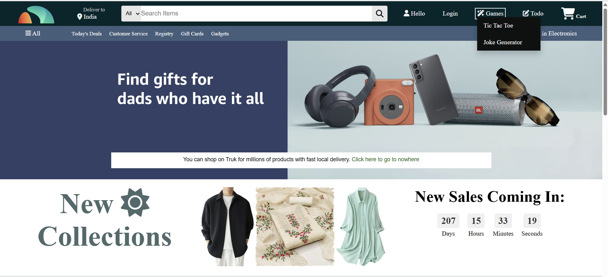
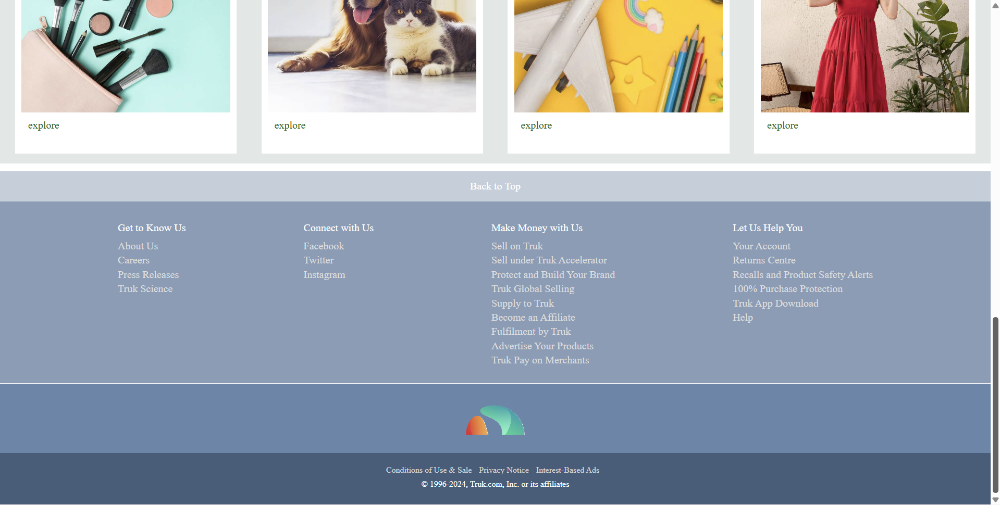
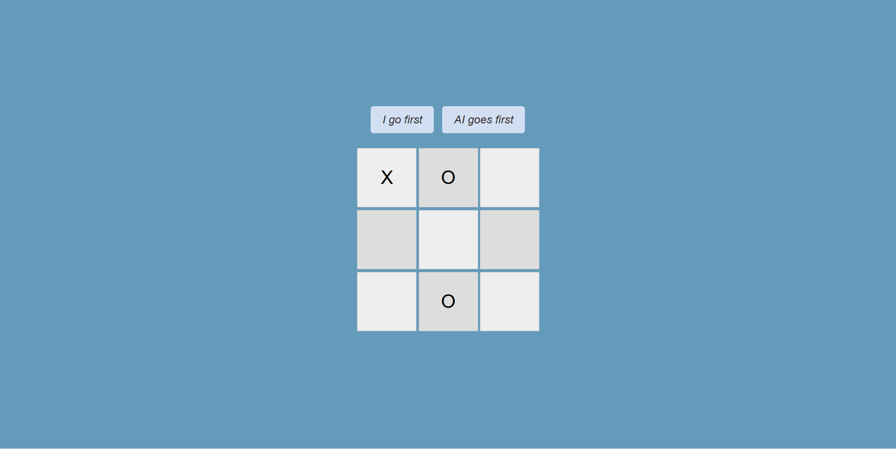
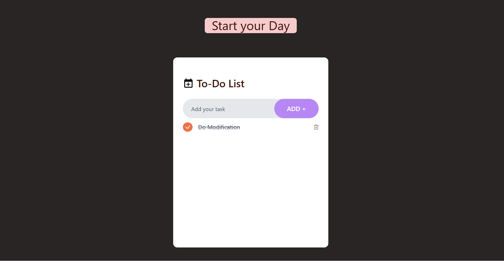

# Truk - A Shopping Website

A shopping web application built on HTML/CSS/JS/REACT/ShadCN (frontend).

## Features

- Countdown for sales
- Games (Tic Tac Toe- Play with AI / 2 Player , Joke Generator)
- Todo List integration
- Authentication

To go to Frontend code - follow this path --> src/main/resources/static

## Screenshot

